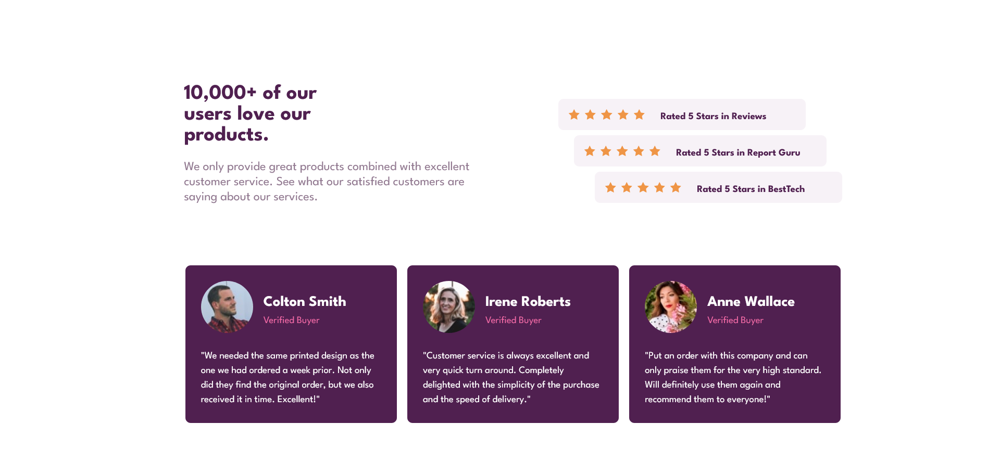

# Frontend Mentor - Social proof section solution

This is a solution to the [Social proof section challenge on Frontend Mentor](https://www.frontendmentor.io/challenges/social-proof-section-6e0qTv_bA). Frontend Mentor challenges help you improve your coding skills by building realistic projects. 

## Table of contents

- [Overview](#overview)
  - [The challenge](#the-challenge)
  - [Screenshot](#screenshot)
  - [Links](#links)
- [My process](#my-process)
  - [Built with](#built-with)
- [Author](#author)

### Screenshot

### Links

- Solution URL: [My Solution](https://github.com/shashikantdev3/FrontendMentor-social-proof-section-master)
- Live Site URL: [Live Preview](https://shashikantdev3.github.io/FrontendMentor-social-proof-section-master/)

## My process

### Built with

- Semantic HTML5 markup
- CSS custom properties
- Flexbox
- CSS Grid

## Author

- Website - [Shashikant](https://www.your-site.com)
- Frontend Mentor - [@shashikantdev3](https://www.frontendmentor.io/profile/shashikantdev3)
- Twitter - [@shashikantdev3](https://www.twitter.com/shashikantdev3)

